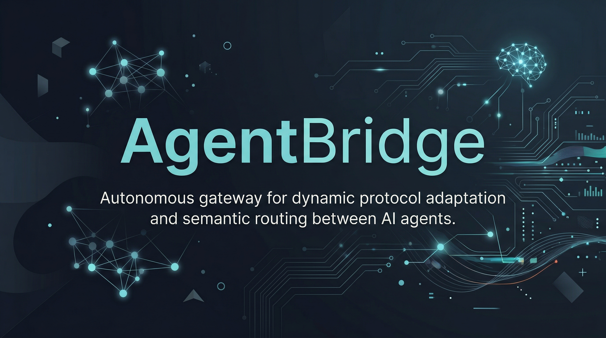

<p align="center">
  
</p>

<h1 align="center">AgentBridge</h1>

<p align="center">
  <strong>Autonomous gateway for dynamic protocol adaptation and semantic routing between AI agents.</strong>
</p>

<p align="center">
  <a href="https://github.com/Lumi-node/agent-bridge"></a>
  <a href="https://github.com/Lumi-node/agent-bridge"></a>
  <a href="https://github.com/Lumi-node/agent-bridge"></a>
</p>

---

AgentBridge is a production-grade autonomous gateway designed to solve the critical interoperability challenge in heterogeneous AI ecosystems. It enables seamless, dynamic protocol adaptation and semantic message routing between diverse AI agent architectures.

This system implements a robust MessageTranslationEngine utilizing Abstract Syntax Tree transformation and bidirectional schema mapping. It converts agent-specific formats (like LangChain tool calls or AutoGPT structures) into a canonical intermediate representation, ensuring agents can communicate regardless of their native protocol.

---

## Quick Start

Install from source:

```bash
git clone https://github.com/Lumi-node/agent-bridge.git
cd agent-bridge
pip install -e ".[dev]"
```

Ingest a LangChain tool call and translate it to canonical format:

```python
import asyncio
import json
from openclaw_gateway.adapters.langchain import LangChainAdapter
from openclaw_gateway.adapters.autogpt import AutoGPTAdapter

async def main():
    # Create protocol adapters
    langchain = LangChainAdapter(agent_id="my_langchain_agent")
    autogpt = AutoGPTAdapter(agent_id="my_autogpt_agent")

    # Ingest a LangChain tool_calls message into canonical format
    raw_msg = json.dumps({
        "tool_calls": [{
            "id": "call_abc123",
            "function": "analyze_document",
            "arguments": {
                "document_id": "doc_001",
                "format": "pdf",
                "size": 1048576
            }
        }]
    }).encode("utf-8")

    canonical = await langchain.ingest(raw_msg)
    print(f"Intent: {canonical.intent}")        # "analyze"
    print(f"Payload: {canonical.payload}")       # {"document_id": "doc_001", ...}

    # Translate canonical message out to AutoGPT task format
    autogpt_bytes = await autogpt.egress(canonical)
    print(f"AutoGPT format: {autogpt_bytes.decode()}")

asyncio.run(main())
```

## What Can You Do?

### Dynamic Protocol Adaptation
AgentBridge handles the translation layer between disparate agent communication standards. Each adapter inherits from `ProtocolAdapter` and implements `ingest()` (raw bytes to canonical) and `egress()` (canonical to raw bytes).

```python
from openclaw_gateway.adapters.base import ProtocolAdapter
from openclaw_gateway.canonical_message import CanonicalMessage

class CustomAdapter(ProtocolAdapter):
    async def ingest(self, raw_message: bytes) -> CanonicalMessage:
        # Parse your agent's native format into canonical
        ...

    async def egress(self, canonical: CanonicalMessage) -> bytes:
        # Serialize canonical back to your agent's format
        ...

adapter = CustomAdapter(agent_id="my_agent", protocol_name="custom")
```

### Semantic Routing
The `ConversationRouter` routes messages based on pre-registered conversation routes with automatic cycle detection (Tarjan's SCC) and ordered fallback agents.

```python
from openclaw_gateway.router import ConversationRouter

router = ConversationRouter()
router.register_route(
    conversation_id="conv_123",
    primary_agent="analyzer",
    fallback_agents=["backup_analyzer"],
    protocol="langchain",
    timeout_ms=30000
)

result = router.get_route("conv_123", intent="analyze")
print(f"Route to: {result.primary}, fallbacks: {result.fallbacks}")
```

## Architecture

The system is structured around a central **Canonical Message** format. Adapters (e.g., `LangChainAdapter`) sit at the edges, responsible for translating between the external agent protocol and the internal canonical format. The core logic resides in the `MessageTranslationEngine`, which manages the bidirectional schema mapping tables.

```mermaid
graph TD
    A[External Agent 1 (LangChain)] -->|Protocol A| B(Adapter Layer);
    C[External Agent 2 (AutoGPT)] -->|Protocol B| B;
    B --> D{MessageTranslationEngine};
    D --> E[Canonical Message Representation];
    E --> F{Semantic Router};
    F --> G[Target Agent];
```

## API Reference

**`openclaw_gateway.canonical_message.CanonicalMessage`**
Pydantic model for the standardized message format. All timestamps are unix floats internally, serialized to ISO-8601 for JSON. Message IDs must be UUID-v4. Critical payload fields are validated per intent type (`analyze`, `delegate`, `stream_result`).

```python
CanonicalMessage(
    message_id="...",           # UUID-v4 string
    source_agent_id="...",      # originating agent
    conversation_id="...",      # hierarchical conversation ID
    message_type="request",     # "request" | "response" | "state_update"
    intent="analyze",           # "analyze" | "delegate" | "stream_result"
    payload={...},              # intent-specific data (validated)
    metadata={...},             # protocol_source, conversation_chain, vector_clock
)
```

**`openclaw_gateway.adapters.base.ProtocolAdapter`**
Abstract base class for all protocol adapters. Requires `agent_id` and `protocol_name` at init.

| Method | Signature | Description |
|--------|-----------|-------------|
| `ingest` | `async (raw_message: bytes) -> CanonicalMessage` | Parse agent-native format to canonical |
| `egress` | `async (canonical: CanonicalMessage) -> bytes` | Serialize canonical to agent-native format |

Built-in adapters: `LangChainAdapter`, `AutoGPTAdapter`, `EventStreamAdapter`

**`openclaw_gateway.router.ConversationRouter`**
Message router with Tarjan's SCC cycle detection and topological sort.

| Method | Description |
|--------|-------------|
| `register_route(conversation_id, primary_agent, fallback_agents, ...)` | Register static route |
| `get_route(conversation_id, intent) -> RouteResult` | Lookup route (O(1)) |
| `check_cycle(conversation_id, from_agent, to_agent) -> bool` | Detect circular delegations |
| `topological_sort() -> List[str]` | Order agents by dependency |

**`openclaw_gateway.cli`**
Typer-based CLI. Usage: `openclaw-gateway --help`

## Research Background

This work draws inspiration from research in distributed systems and heterogeneous computing, specifically concerning middleware design for complex, evolving agentic workflows. The concept of a canonical message bus is rooted in established patterns for microservice communication, adapted here for the unique challenges of AI agent state and protocol variance.

## Testing

The project maintains comprehensive test coverage, with **84 test files** ensuring the stability of the translation and routing logic across various adapter implementations.

## Contributing

We welcome contributions! Please refer to the contribution guidelines in the repository for details on submitting pull requests, reporting bugs, and suggesting features.

## Citation

This project is inspired by foundational work in multi-agent systems and protocol negotiation. Further reading on agent interoperability is recommended.

## License
The AgentBridge project is licensed under the MIT License - see the [LICENSE](LICENSE) file for details.