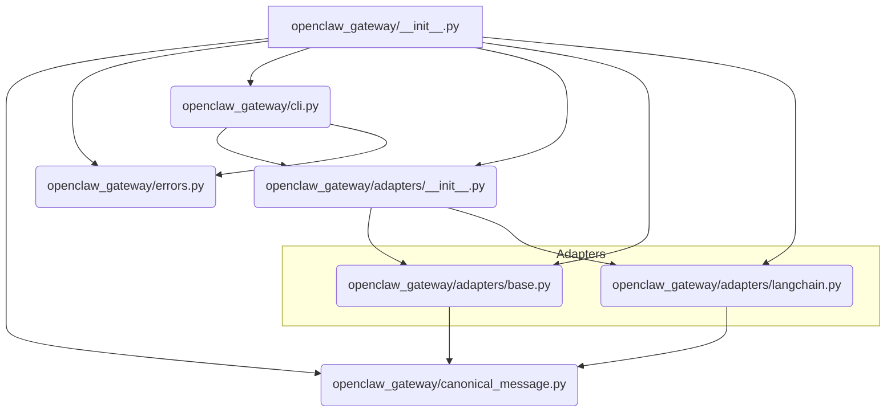

# AgentBridge Architecture

AgentBridge is designed to be a robust, production-grade autonomous agent gateway system. Its core mission is to facilitate seamless, dynamic communication between heterogeneous AI agent architectures. It achieves this by providing a unified interface layer that handles protocol adaptation, semantic message routing, and distributed state coordination, ensuring resilience and interoperability across diverse agent ecosystems.

## System Overview

The architecture centers around the `openclaw_gateway` package, which acts as the central nervous system. It abstracts away the complexities of underlying agent frameworks (like LangChain, AutoGPT, etc.) by enforcing a canonical message format. The system utilizes a sophisticated `MessageTranslationEngine` powered by Abstract Syntax Tree (AST) transformations and bidirectional schema mapping to translate messages accurately between disparate agent dialects, enabling true semantic interoperability.

## Module Relationships

The following diagram illustrates the structural dependencies within the `openclaw_gateway` module.

## Module Descriptions

| Module | Path | Role |
| :--- | :--- | :--- |
| **Gateway Entry Point** | `__init__.py` | Initializes the gateway components, manages service registration, and provides the primary public interface for the system. |
| **Canonical Message** | `canonical_message.py` | Defines the standardized, internal message structure used across the entire system. This acts as the lingua franca, decoupling agents from each other. |
| **Errors** | `errors.py` | Central repository for custom exceptions and error handling logic, ensuring predictable failure recovery across the gateway. |
| **CLI Interface** | `cli.py` | Provides a command-line interface for testing, configuration, and direct interaction with the gateway services. |
| **Adapter Base** | `adapters/base.py` | Defines the abstract interface (`BaseAdapter`) that all specific agent adapters must implement. This enforces a contract for message translation and interaction. |
| **LangChain Adapter** | `adapters/langchain.py` | Implements the specific logic to translate between the Canonical Message format and the proprietary message structures used by LangChain agents (e.g., tool calls, prompt structures). |
| **Message Translation Engine** | *(Implied within Adapters/Base)* | The core logic responsible for AST transformation and schema mapping. It takes a message in one format, parses its structure, maps it against bidirectional schema tables, transforms it into the Canonical format, and then transforms it into the target agent's format. |

## Data Flow Explanation

The data flow in AgentBridge follows a clear pattern of **Ingestion $\rightarrow$ Canonicalization $\rightarrow$ Routing $\rightarrow$ Adaptation $\rightarrow$ Egress**.

1. **Ingestion (External Agent $\rightarrow$ Gateway):** An external agent (e.g., a LangChain agent) sends a request or message to the AgentBridge gateway. This message is in the agent's native format (e.g., a specific LangChain tool call structure).
2. **Adaptation (Inbound):** The request is routed to the appropriate adapter (e.g., `LangChainAdapter`). The adapter uses its internal logic, leveraging the **Message Translation Engine**, to parse the native structure. It then performs **AST transformation** and schema mapping to convert the message into the **Canonical Message** format defined in `canonical_message.py`.
3. **Routing & Coordination (Internal):** The Canonical Message is passed through the gateway's routing logic. Here, distributed state coordination mechanisms (not explicitly detailed in the modules but implied by the goal) determine the correct target agent or service.
4. **Adaptation (Outbound):** The Canonical Message is passed to the target agent's adapter. This adapter performs the reverse process: it uses the **Message Translation Engine** to map the Canonical Message structure back into the target agent's required format (e.g., AutoGPT command structure).
5. **Egress (Gateway $\rightarrow$ External Agent):** The translated, native message is sent out to the receiving agent.

This flow ensures that the core business logic of the agents remains agnostic to the communication protocols of other agents, as all translation occurs transparently within the gateway layer.